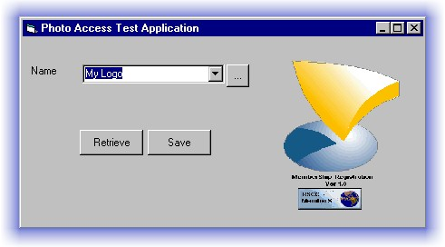



## Photo Access

### Description

This OCX will helps you to retrieve all types of images supported by the Visual Basic Picture box in one line of code. It save it to- and read it from an access database. It support Ado and DAO.

You can browse for photo images on your harddisk with the filebrowser included into the OCX. This browser also remember the last directory.

This code is well commented. Just click on the ocx, drag it on a form and start programming.

This code has not been tested on SQL server jet.

I've included a sample application to show you how it works. I hope it will be an attribute to your programming needs. For any comment mail me at Tigersoftware@rodneysafrcomputing.8m.com

Have Fun.

Rodney Godfried
 
### More Info
 
Database field name where the photo image has to be saved or readed

You need ADO 2.1 or later and Microsoft DAO 2.5/3.51 compatibility Library or later, Selected in the references dialog box.

The image

             |
---                |---
**Submitted On**   |2000-12-18 08:38:14
**By**             |[Rodney Safe Computing \(Tiger Software\)](https://github.com/Planet-Source-Code/PSCIndex/blob/master/ByAuthor/rodney-safe-computing-tiger-software.md)
**Level**          |Intermediate
**User Rating**    |4.5 (45 globes from 10 users)
**Compatibility**  |VB 4\.0 \(16\-bit\), VB 4\.0 \(32\-bit\), VB 5\.0, VB 6\.0, VBA MS Excel
**Category**       |[Databases/ Data Access/ DAO/ ADO](https://github.com/Planet-Source-Code/PSCIndex/blob/master/ByCategory/databases-data-access-dao-ado__1-6.md)
**World**          |[Visual Basic](https://github.com/Planet-Source-Code/PSCIndex/blob/master/ByWorld/visual-basic.md)
**Archive File**   |[CODE\_UPLOAD1282712192000\.zip](https://github.com/Planet-Source-Code/rodney-safe-computing-tiger-software-photo-access__1-13693/archive/master.zip)

